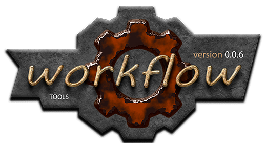

  

Description of the workflow
===========================
Правила организации рабочего процесса.  

[Фундаментальный закон разработки][1-LAW-DEVELOMPENT]

----------------------------------------------------------------

Принципы версионирования:  
  1. Что такое "[версия][VR]" ?  
  2. Концепция "[Семантического Версионирования][SV]"  
  3. [Правила версионирования][WV] принятые в `WorkSpace`.  

[VR]: docs/workflow/version/010-version-format.md
    "общие сведения"  
[SV]: docs/workflow/version/020-version-semantic.md
    "семантическое версионирование"  
[WV]: docs/workflow/version/030-version-workspace.md 
    "правила версионирования принятые в workspace"  

----------------------------------------------------------------

Пошаговые пример-иллюстрации:
  - [пример выполнения первой задачи docs](docs/slides/1-docs/main.md)  

----------------------------------------------------------------

[История](docs/history.md)  

[1-LAW-DEVELOMPENT]: docs/principles.md  "Фундаментальный закон разработки"