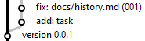

[M]: #main  "история проекта"
[B]: icons/bug.png

<a name="main"></a>
История развития проекта
========================

Фундаментальный закон разработки:  
  - **История не знает сослагательного наклонения**  

Из этого фундаментального закона вытекает:  
  - История движется только вперед.  
  - Нельзя вернуться в прошлое, и всё исправить.  
  - Нельзя изменить содержимое мерж-коммита.  
  - Можно признать версию забагованной,  
    и выпустить исправление.  

--------------------------------------------------------------------------------

Мы не подтасовываем историю:  
  - Не пытаемся изменять старые коммиты в мастере.  

--------------------------------------------------------------------------------

Мы не пересоздаем репозиторий.  
Потому что уничтожение репозитория влечет за собой удаление связанных с ним `контрибуций`  
  - `констрибуция` - это вклад в развитие аккаунта на [github][CONTRIB]  

Историю репозитория можно сбросить с помощью команды `reset`  
Но нужно подумать дважды, прежде чем решиться на такой шаг:  
  - `reset` полностью уничтожает часть истории проекта.  
  - но счетчики `ID-задач` при этом не сбрасываются.  

Выполнять `reset` имеет смысл только для молодых проектов,  
развитие которых зашло в тупик.  

Нельзя уничтожать историю от которой уже зависят клиенты.  
<br />

[CONTRIB]: https://docs.github.com/en/github/setting-up-and-managing-your-github-profile/managing-contribution-graphs-on-your-profile/why-are-my-contributions-not-showing-up-on-my-profile
  "Learn how we count contributions"


Главный вопрос истории проектов
-------------------------------

Можно сформулировать так:  
если история не обратима, то как тогда исправлять ошибки?  

Например, мы уже влили в мастер пулл-реквест,  
и уже только после этого обнаружилось, что он был неправильным.  
Как исправить ошибку ?  

Всё множество возможных вариантов можно свести к двум стратегиями:  
  - `correction`  
  - `reset`  

reset
-----

Этот метод подходит для случая,  
когда в мастере ещё не было релизного коммита.  

Суть метода: уничтожаем один или несколько последних коммита.  

Например: самый последний коммит - это мерж пулл-реквеста.  
Если удалить этот коммит, тогда с точки зрения истории получится,  
что никакого мержа никогда и не было.  
После чего можно вернуться в ветку задачи,  
и внести все необходимые правки.  

**ВАЖНО** После всех правок нужно будет подправить даты свежих коммитов.  
что бы они не нарушали хронологию истории развития проекта.  

<details>
<summary>Как изменить дату коммита</summary>

  Специально для этой цели разработан батник:  
  ```docs/utils/git-date.bat```

  Внутри батника описаны два метода:  
    - изменение даты самого последнего коммита.  
    - изменение даты любого коммита.  

  ---------------------------------------------

</details>

В итоге, в истории будет фигурировать  
только один единственный правильный пулл-реквест.  
Однако по значению его `ID-задачи` будет видно,  
что данный пулл-реквест это - не первая попытка.  

Точно таким же образом можно отменить сразу несколько пулл-реквестов.  
Например, в мастер было влито сразу 3 штуки пулл-реквестов.  
Ошибка закралась в самый старый.  
В этом случае можно просто отменить все три пулл-реквеста,  
после чего исправить ошибку в ветке, и затем заново,  
в той же последовательности, воспроизвести все три пулл-реквеста.  

В целом, метод `reset` - это отличный метод,  
позволяющий содержать историю мастера в чистоте.  

**ВАЖНО** пока не вышел релизный коммит,  
необходимо сохранять все те ветки,  
которые участвовали в создании пулл-реквестов.  
В противном случае, починить пулл-реквесты не получится.  

**ID-задачи** может расти нелинейно.  
Например, одна задача будет #1,  
а другая сразу #5 - это нормально.  
Ошибки случаются, ошибки нужно исправлять.  

correction
----------

Этот метод используется в тех случаях,  
когда по некоторым причинам уже нельзя откатить историю.  

Например: в мастере уже был добавлен релизный коммит,
у которого уже появились новые ветки.  

В таком случае есть два варианта:  
  - мелкая правка текста.  
  - исправление бага.  

Если исправление ошибки требует лишь мелкую правку текста,  
то сделать такое исправление можно в рамках любой задачи.  
Для этого перед коммитом `add: task`,  
добавляется фиксирущий коммит: `fix: имя_файла`  
       
Например, вот здесь был исправленна опечатка в файле предыдущей задачи:  
<details>
<summary>Скриншот</summary>
  <a href="#main" title="fix"></a>
  <br/>
</details>

А вот здесь исправленна опечатка в файле истории:  
Обратите внимание: фикс-коммит добавлен уже после `add: task`  
Технически так тоже можно.  

<details>
<summary>Скриншот</summary>
  <a href="#main" title="fix"></a>
  <br/>
</details>

Но лучше делать фикс-коммит перед `add: task`  
Тогда история будет получаться более удобно-читабельной.  

Если же ошибка серьёзная, и затронула функциональность,  
тогда нужно заводить полноценную задачу на исправление `бага`.  
В задаче указываем какой именно баг нужно исправить.  

В истории проекта, при первой же возможности,  
нужно сменить иконку забраковааной версии  
на изображение жука [![B]][M]  


