[M]: #main  "история проекта"
[P]: ../../icons/progress.png
[S]: ../../icons/success.png

Пример выполнения первой задачи #1_docs
=======================================

1. Создаем задачу на сайте-треккере:  
   - рекомендуем сначала записать текст задачи  
     в отдельном текстовом файле,  
     и затем скопировать текст на сайт.  

    
   

   
Скриншот

     <a href="#main" title="issue">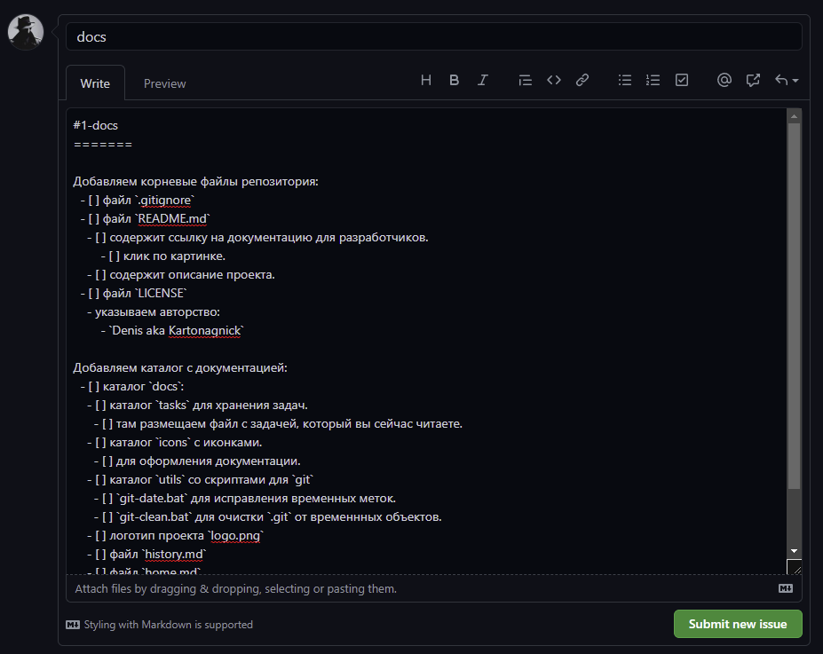</a>
      
   

2. Обратите внимание:  
   - В названии параграфа через символ `#` указывается имя задачи.  
     Значек `#` позволяет сайтам-треккерам связывать параграф с задачей.  
   - Описание задачи задаётся в формате чек-листа.  
     - Описание должно быть достаточно полным,  
       что бы исполнителю было понятно,  
       что от него требуется.  
     - Формат в виде чек-листа нужен,  
       что бы можно было галочками отмечать прогресс работы.  

    
   

   
Скриншот

     <a href="#main" title="issue">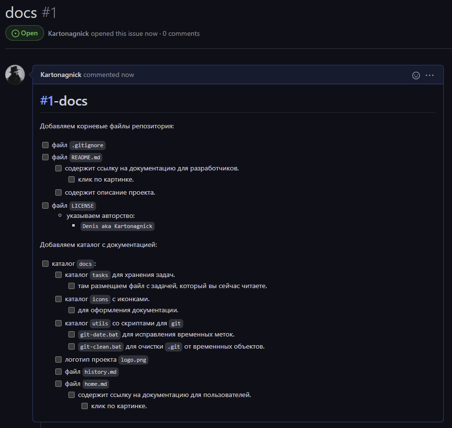</a>
      
   

3. Когда программист будет готов,  
   он перекладывает карточку задачи в столбец "In Progress"  
   С этого момента задача считается в процессе изготовления.  

    
   

   
Скриншот

     <a href="#main" title="issue">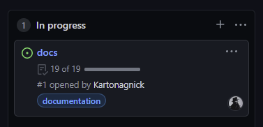</a>
      
   

   На скриншоте видно: выполненно 19 пунктов из 19  
   Каждый пункт - это галочка в чек-листе задачи.  
   Когда программист выполняет очередной пункт задачи, он ставит галочку.  
   Таким образом определяется прогресс выполнения задачи.  

   Согласно скриншоту уже проставлены все пункты задачи.  
   То есть, вся задача выполнена.  
   Но в реальности пункты должны проставляться не сразу,  
   а лишь по мере выполнения задачи.  

------------------------------    

4. Теперь, зная ID-задачи, создаём бранч:  
     - Имя бранча задаётся в формате: `#ID_ИмяЗадачи`  

    
   

   
Скриншот

     <a href="#main" title="branch">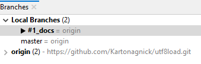</a>
      
   

  
   Вся работа над задачей должна происходить в своей отдельной ветке.  

------------------------------    

5. Первый коммит в бранче должен содержать файл задачи:  
     - Комментарий может быть любым,  
       но по нему должно быть сразу понятно,  
       что это - коммит задачи.  
     - Примеры возможных комментариев:  
       - `add: docs/tasks/...`  
       - `add: task`  
6. Сразу указываем:  
     - Дату начала работы над задачей.  
     - Предполагаемую дату окончания работы над задачей.  
     - Предполагаемое время, которое будет затраченно на эту задачу.  
     - Описание задачи должно совпадать с описанием на сайте.  

    
   

   
Пример содержимого файла задачи

     <a href="#main" title="task">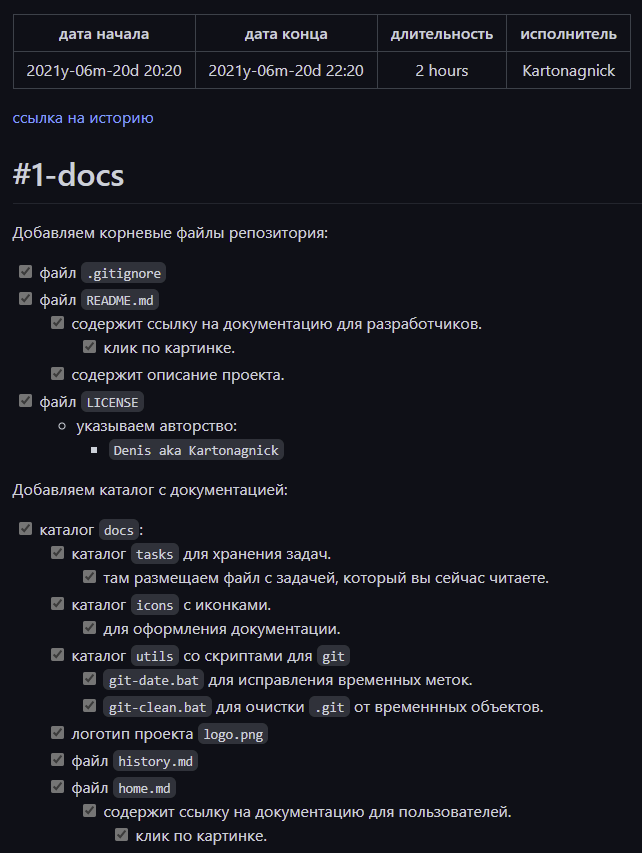</a>
      
   

   Галочки в этом файле проставляются по мере выполнения пунктов задачи.  
   Ссылка на историю кликабельная:  
     - Ведет на историю предполагаемой версии.  

------------------------------    

7. Далее коммитим все необходимые изменения.  

    
   

   
Скриншот бранча

     <a href="#main" title="branch">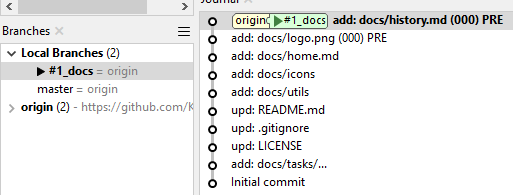</a>
      
   

   Для версионных элементов указываем версию элемента:  
     - действительную, если версия осталась прежней.  
     - предварительную, если версия изменилась.  

8. Завершающим коммитом в бранче должен быть файл истории.  

    
   

   
Скриншот Файла истории

     <a href="#main" title="history">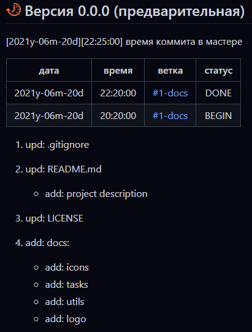</a>
      
   

   В файле истории, в разделе предполагаемой версии,  
   в виде таблицы указываем:  
     - иконку [![P]][M] - означает, что задача ещё не завершена.  
     - предполагаему дату завершения работы над версией.  

   Далее в виде таблицы указываем:  
     - предполагаемую дату окончания работы над задачей (DONE)  
     - дату начала работы над задачей (BEGIN)  

------------------------------    

9. Когда задача завершена:  
     - Выполняем осмотр задачи:  
       - Может быть где-то какие то файлы забыли указать.  
       - Может быть где-то какие то версии забыли изменить.  
       - Вносим последние правки.  
     - Расставляем коммиты в правильной последовастельности:  
       - Первый коммит всегда о добавлении задачи: `add: task`  
       - Версионные элементы фиксируются отдельными коммитами, с указанием версии.  
       - Порядок следования коммитов:  
         - В хронологическом порядке.  
         - По возможности не должен ломать сборку.  
       - Последний коммит всегда об изменении истории: `upd: docs/history.md`  

10. Кроме того, в конце работы приводим в порядок даты:  
      - Дата начала работы над задачей совпадает:  
        - С датой начала в файле задачи.  
        - С датой начала в таблице истории.  
        - С датой первого коммита в бранче.  
      - Дата окончания работы над задачей совпадает:  
        - С датой окончания в файле задачи.  
        - С датой окончания в таблице истории.  
        - С датой последнего коммита в бранче.  

11. Ещё раз проверяем даты и имя бранча.  
12. Проверяем, что кликабельные ссылки работают правильно.  

-------------------------------------------
  
13. Создаём пулл-реквест:  
      - Это - запрос на вливание бранча в мастер:  

     
    

    
Скриншот

      <a href="#main" title="pull_request">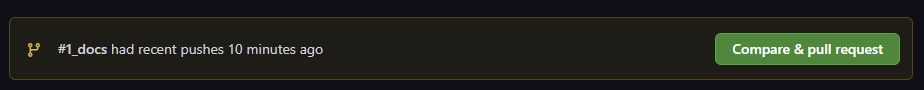</a>
       
    

    Обратите внимание:  
      - Имя пулл-реквеста начинается со слова `fix`  
      - Текст для описания берется из файла истории.  

     
    

    
Скриншот

      <a href="#main" title="pull_request">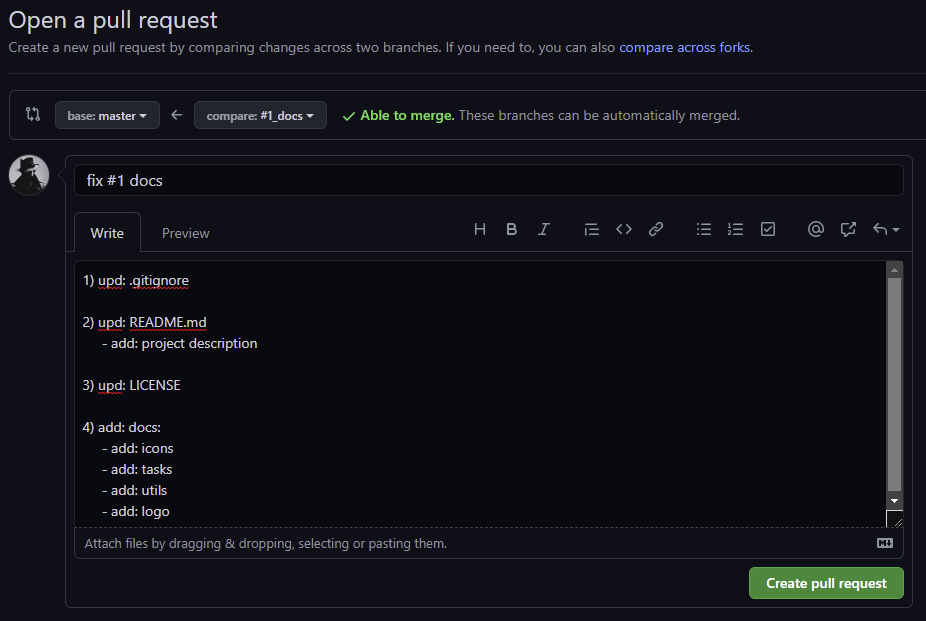</a>
       
    

    Созданный пулл-реквест выглядит так:  

     
    

    
Скриншот

      <a href="#main" title="pull_request">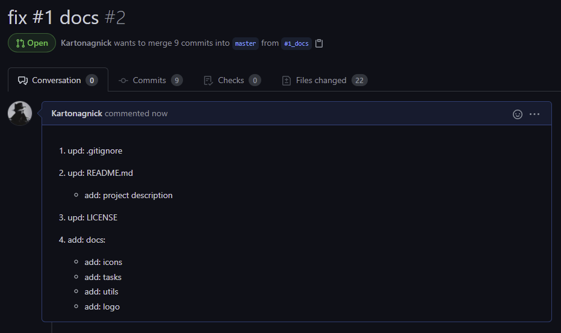</a>
       
    

    На доске появится карточка пулл-реквеста.  

     
    

    
Скриншот

      <a href="#main" title="pull_request">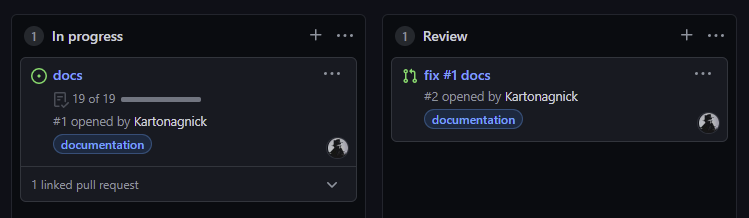</a>
       
    

-------------------------------------------

14. После чего пулл-реквест проходит `code-review`
      - Могут быть притензии, дополнительные правки, и тп.  

    Когда пулл-реквест будет одобрен,  
    владелец нажмёт на кнопку `merge pull request`  

     
    

    
Скриншот

      <a href="#main" title="pull_request">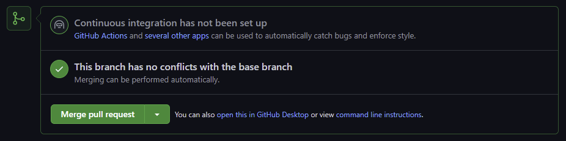</a>
       
    

    После чего веточка будет влита в мастер:  

     
    

    
Скриншот

      <a href="#main" title="pull_request">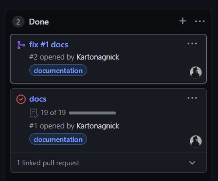</a>
       
    

-------------------------------------------

15. Теперь разработчик переключается на мастер

     
    

    
Скриншот

      <a href="#main" title="branch">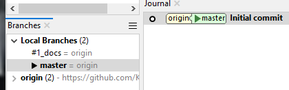</a>
       
    

    И подгружает изменения:  

     
    

    
Скриншот

      <a href="#main" title="branch">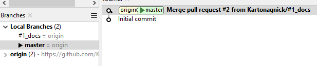</a>
       
    

    Итоговый результат в мастере:

     
    

    
Скриншот

      <a href="#main" title="branch">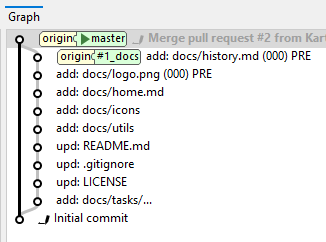</a>
       
    

-------------------------------------------

16. На этом работа над задачей завершена.  
    Разработчик приступает к выполнению следующей задачи.  

17. В какой то момент, когда в мастере накопится достаточное кол-во пулл-реквестов,  
    Руководитель проекта может выпустить очередной релиз.  
    Для этого необходимо создать релизный коммит.  

18. Релизный коммит имеет формат: `version X.Y.Z`

     
    

    
Скриншот

      <a href="#main" title="smartgit">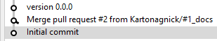</a>
       
    

    Дата релизного коммита должна совпадать с датой,  
    которая указана в файле истории.  

     
    

    
Скриншот

      <a href="#main" title="smartgit">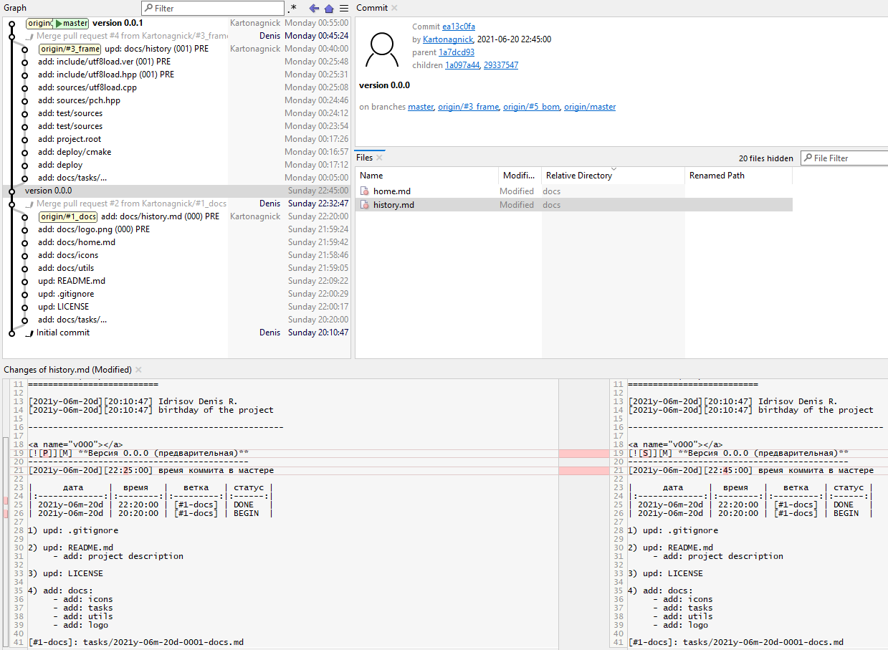</a>
       
    

    Иконка новой версии сменяется на [![S]][M]  

19. В релизном коммите допускается:  
      - исправлять PRE версии на актуальные.  
      - заменять иконки [![P]][M] на [![S]][M]  
      - исправлять ошибки в тексте документации.  
      - проставить пропущенные галочки.  
      - исправлять ошибки в датах.  

20. В релизном коммите не допускается:  
      - вносить правки, которые влияют на функциональность:  
      - нельзя вносить правки в документацию,  
        которые искажают понимание функциональности.  
      - нельзя изменять код.  

21. Начиная с версии `1.0.0`, релизный коммит нельзя сквошить.  
